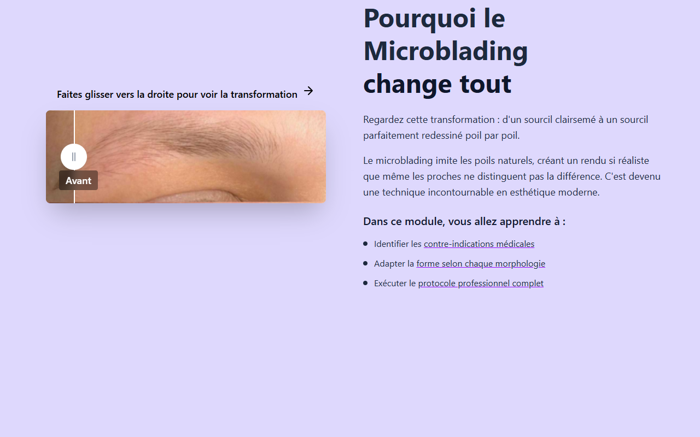

# Intro Slider — Microblading & Microblading EN (Shared)

**Course:** MICROBLADING & MICROBLADING (EN)  
**Slide:** 1  
**Live URL:** https://v0-microblading-slider-design.edtechiecorp.com  
**Stack:** Next.js · Tailwind CSS · TypeScript · GitHub Pages  

## What this slide does

Shared opening intro slider used by both the French and English microblading courses. Displays the course title, key visual branding, and a brief welcome message that sets the tone for the learning journey. The slider format eases learners into the course with visual impact before moving into theoretical and practical content.

## Screenshot

## Usage

This slide is embedded as an iframe inside Coassemble at the live URL above. DNS is managed via Cloudflare (`edtechiecorp.com`). To update the slide, push to the `main` branch — GitHub Actions will rebuild and redeploy automatically.
